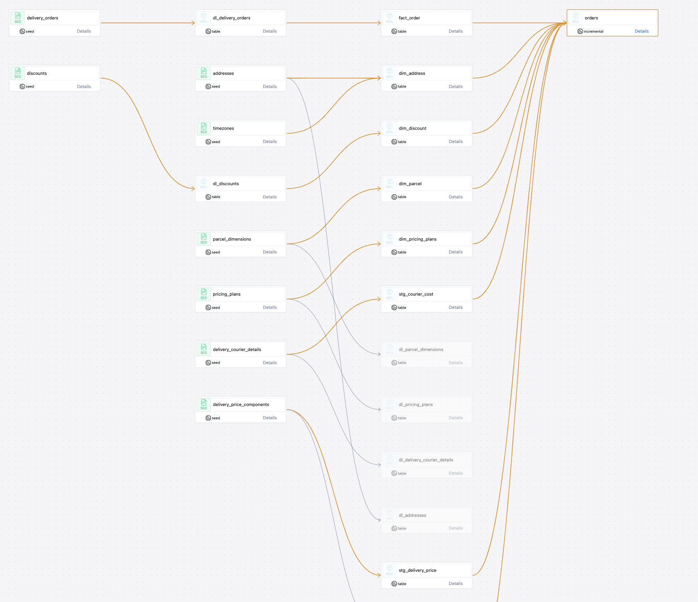

Courier deliveries project

### Using the project

Requires python 3.
Using duckdb as a stand in db/datawarehouse as setting up bigquery, snowflake etc will take time

```
python3 -m venv dbt-env
source dbt-env/bin/activate
python3 -m pip install dbt-duckdb

dbt debug # to check connection to database

dbt build
```

The `couriersdb` database will be created in the root of the project and can be viewed with tools like dbeaver.

### Project Structure

#### /seeds
Contains csv files with dummy data which can be loaded with a `dbt seed` command

#### /datalake
Contains data loaded from the seed files
In the real world, incoming data from external sources will come and sit here. The data here should not be altered or transformed. This is data received `as is` from the source. Also, records should not be modified/deleted only appended. So, this will have historical record.

#### /stage
The layer where most of the data transformation will take place

#### /datawarehouse
Contains dimension and fact tables. Can be consumed by other teams.

#### /reporting
Contains transformed big tables which can be used for reporting

In datawarehouses like bigquery, snowflake etc. datalake, stage, datawarehouse, reporting would be separate datasets. Unfortunately that is not supported by duckdb.



